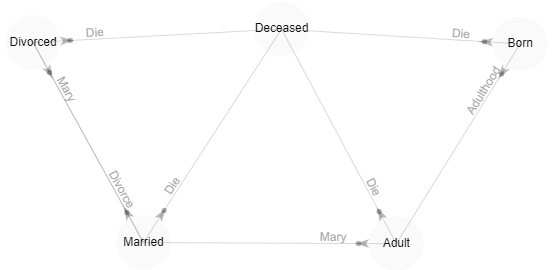

# Virtual Society Simulation

## Components

The following open source components are used for simulations

### Sim# (SimSharp) [](https://ci.appveyor.com/project/abeham/simsharp/branch/master)
A .NET port and extension of SimPy, process-based discrete event simulation framework
<br/>

https://github.com/abeham/SimSharp
### Stateless [](https://ci.appveyor.com/project/DotnetStateMachine/stateless/branch/master) [](https://www.nuget.org/packages/stateless) [](https://gitter.im/dotnet-state-machine/stateless?utm_source=badge&utm_medium=badge&utm_campaign=pr-badge&utm_content=badge) [](http://stackoverflow.com/questions/tagged/stateless-state-machine)

Create *state machines* and lightweight *state machine-based workflows* directly in .NET code:
<br/>
https://github.com/dotnet-state-machine/stateless/blob/dev/README.md


Stateless is mainly used for state integrity of simulated objects.

```csharp
public PersonState(LifeEvents initialState) : base(initialState)
{
    Machine.Configure(LifeEvents.Born)
        .Permit(LifeEventsTriggers.Die, LifeEvents.Deceased)
        .Permit(LifeEventsTriggers.Adulthood, LifeEvents.Adult);
    Machine.Configure(LifeEvents.Adult)
        .Permit(LifeEventsTriggers.Die, LifeEvents.Deceased)
        .Permit(LifeEventsTriggers.Mary, LifeEvents.Married);
    Machine.Configure(LifeEvents.Married)
        .Permit(LifeEventsTriggers.Die, LifeEvents.Deceased)
        .Permit(LifeEventsTriggers.Divorce, LifeEvents.Divorced);
    Machine.Configure(LifeEvents.Divorced)
        .Permit(LifeEventsTriggers.Die, LifeEvents.Deceased)
        .Permit(LifeEventsTriggers.Mary, LifeEvents.Married);
    Machine.Activate();
}
```


Stateless is extended so the states and triggers / flow can be easily visualized in Force Directed Graphs using force graph.

### force-graph [![NPM package][npm-img]][npm-url] [![Build Size][build-size-img]][build-size-url] [![Dependencies][dependencies-img]][dependencies-url]
Force-directed graph rendered on HTML5 canvas.
<br/>
https://github.com/vasturiano/force-graph

[npm-img]: https://img.shields.io/npm/v/force-graph.svg
[npm-url]: https://npmjs.org/package/force-graph
[build-size-img]: https://img.shields.io/bundlephobia/minzip/force-graph.svg
[build-size-url]: https://bundlephobia.com/result?p=force-graph
[dependencies-img]: https://img.shields.io/david/vasturiano/force-graph.svg
[dependencies-url]: https://david-dm.org/vasturiano/force-graph

### Math .NET  [](https://ci.appveyor.com/project/cdrnet/mathnet-numerics)  
Math.NET Numerics is the numerical foundation of the Math.NET initiative, aiming to provide methods and algorithms for numerical computations in science, engineering and every day use. Covered topics include special functions, linear algebra, probability models, random numbers, statistics, interpolation, integration, regression, curve fitting, integral transforms (FFT) and more.
<br />
https://github.com/mathnet/mathnet-numerics